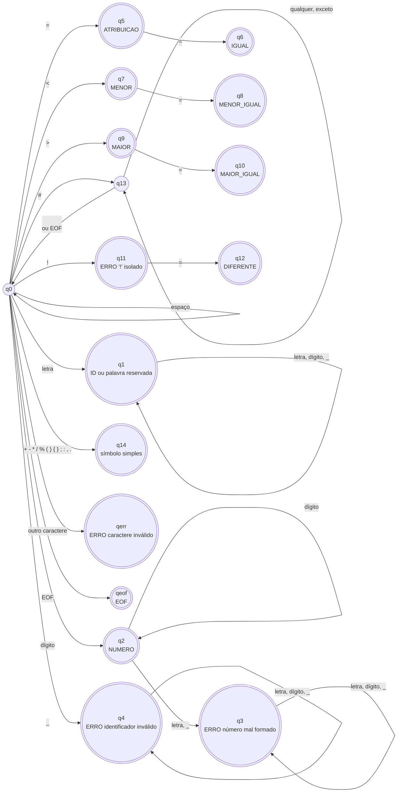

# M1 — Especificação léxica e AFD da MiniLang

Este documento descreve formalmente o analisador léxico implementado em
[`minilang/lexer.py`](../minilang/lexer.py): o alfabeto, as expressões
regulares de cada categoria de token, o AFD (diagrama e tabela de transição) e
o tratamento de erros.

## 1. Alfabeto

| Classe | Caracteres |
|---|---|
| `letra` | `a–z`, `A–Z` e as letras acentuadas `á à â ã é ê í ó ô õ ú ü ç` (maiúsculas e minúsculas) |
| `dígito` | `0–9` (apenas ASCII; `²` ou `٣` não são dígitos) |
| `espaço` | espaço, tabulação (`\t`), retorno de carro (`\r`) e quebra de linha (`\n`) |
| `símbolo` | `+ - * / % = < > ! ( ) { } ; : , . # _` |

Qualquer caractere fora dessas classes gera erro léxico (inclusive espaço não
separável, emojis etc.).

A linguagem **diferencia maiúsculas de minúsculas**: `fim` é palavra
reservada, `FIM` é identificador.

## 2. Expressões regulares

| Token | Expressão regular | Exemplos |
|---|---|---|
| `IDENTIFICADOR` | `letra (letra \| dígito \| _)*` | `x`, `contador_1`, `ação` |
| palavra reservada | mesmo padrão de identificador, desde que o lexema esteja na tabela de palavras reservadas | `programa`, `senão` |
| `NUMERO` | `dígito+` | `0`, `42`, `9999` |
| `ATRIBUICAO` / `IGUAL` | `=` / `==` | |
| `MENOR` / `MENOR_IGUAL` | `<` / `<=` | |
| `MAIOR` / `MAIOR_IGUAL` | `>` / `>=` | |
| `DIFERENTE` | `!=` | |
| aritméticos | `\+` · `-` · `\*` · `/` · `%` | |
| delimitadores | `\(` · `\)` · `\{` · `\}` · `;` · `:` · `,` · `\.` | |
| comentário (descartado) | `# [^\n]*` | `# isto é ignorado` |
| espaço (descartado) | `[ \t\r\n]+` | |

**Palavras reservadas:** `programa`, `var`, `inteiro`, `booleano`, `se`,
`senão`, `enquanto`, `escreva`, `leia`, `verdadeiro`, `falso`, `e`, `ou`,
`não`, `fim`. As formas sem acento `senao` e `nao` são aceitas como sinônimos
de `senão` e `não`.

**Regra do maior prefixo (maximal munch):** o lexer sempre reconhece o maior
token possível. Por isso `<=` é um único token, e `===` vira `==` seguido de
`=`.

## 3. Diagrama do AFD

Estados com círculo duplo são **estados finais** (aceitam um token). As
transições "outro" **não consomem** o caractere: o autômato para, emite o
token do estado atual e volta a `q0` com esse caractere ainda na entrada
(lookahead de 1 caractere).

`q3`, `q4`, `q11` e `qerr` são finais **de erro**: emitem um token `ERRO`,
registram a mensagem e a análise continua em `q0`.

No código, `q14` é uma consulta à tabela `SIMBOLOS_SIMPLES`; formalmente, cada
símbolo leva a um estado final próprio (ver tabela abaixo).

## 4. Tabela de transição

Legenda: **→** estado inicial · **\*** estado final · "outro" = qualquer
caractere não listado naquele estado (não é consumido).

| Estado | Entrada | Próximo estado | Ação / token emitido |
|---|---|---|---|
| **→ q0** | espaço (`' '`, `\t`, `\r`, `\n`) | q0 | descarta |
| q0 | `#` | q13 | início de comentário |
| q0 | letra | q1 | |
| q0 | dígito | q2 | |
| q0 | `_` | q4 | |
| q0 | `=` | q5 | |
| q0 | `<` | q7 | |
| q0 | `>` | q9 | |
| q0 | `!` | q11 | |
| q0 | `+` | q14 | emite `SOMA` |
| q0 | `-` | q14 | emite `SUBTRACAO` |
| q0 | `*` | q14 | emite `MULTIPLICACAO` |
| q0 | `/` | q14 | emite `DIVISAO` |
| q0 | `%` | q14 | emite `MODULO` |
| q0 | `(` | q14 | emite `ABRE_PAREN` |
| q0 | `)` | q14 | emite `FECHA_PAREN` |
| q0 | `{` | q14 | emite `ABRE_CHAVE` |
| q0 | `}` | q14 | emite `FECHA_CHAVE` |
| q0 | `;` | q14 | emite `PONTO_VIRGULA` |
| q0 | `:` | q14 | emite `DOIS_PONTOS` |
| q0 | `,` | q14 | emite `VIRGULA` |
| q0 | `.` | q14 | emite `PONTO` |
| q0 | fim da entrada | qeof | emite `EOF` |
| q0 | outro | qerr | emite `ERRO` — "caractere inválido" |
| **\* q1** | letra, dígito, `_` | q1 | |
| q1 | outro | q0 | emite palavra reservada (se o lexema estiver na tabela) ou `IDENTIFICADOR` |
| **\* q2** | dígito | q2 | |
| q2 | letra, `_` | q3 | |
| q2 | outro | q0 | emite `NUMERO` |
| **\* q3** | letra, dígito, `_` | q3 | |
| q3 | outro | q0 | emite `ERRO` — "número mal formado" |
| **\* q4** | letra, dígito, `_` | q4 | |
| q4 | outro | q0 | emite `ERRO` — "identificador inválido" |
| **\* q5** | `=` | q6 | |
| q5 | outro | q0 | emite `ATRIBUICAO` |
| **\* q6** | — | q0 | emite `IGUAL` |
| **\* q7** | `=` | q8 | |
| q7 | outro | q0 | emite `MENOR` |
| **\* q8** | — | q0 | emite `MENOR_IGUAL` |
| **\* q9** | `=` | q10 | |
| q9 | outro | q0 | emite `MAIOR` |
| **\* q10** | — | q0 | emite `MAIOR_IGUAL` |
| **\* q11** | `=` | q12 | |
| q11 | outro | q0 | emite `ERRO` — "'!' isolado" |
| **\* q12** | — | q0 | emite `DIFERENTE` |
| q13 | qualquer caractere exceto `\n` | q13 | descarta |
| q13 | `\n` ou fim da entrada | q0 | fim do comentário (nenhum token) |
| **\* q14** | — | q0 | emite o token do símbolo lido |
| **\* qerr** | — | q0 | (erro já registrado) |
| **\* qeof** | — | — | fim da análise |

## 5. Correspondência com o código

| Parte do AFD | Método em `lexer.py` |
|---|---|
| q0 (escolha do caminho) | `proximo_token()` |
| q0 ↺ espaço, q13 (comentário) | `_pular_espacos_e_comentarios()` |
| q1 | `_ler_identificador_ou_palavra_reservada()` |
| q2, q3 | `_ler_numero()` |
| q4 | `_ler_identificador_invalido()` |
| q5–q12 (lookahead) | `_ler_operador_com_lookahead()` + tabela `OPERADORES_COM_LOOKAHEAD` |
| q14 | tabela `SIMBOLOS_SIMPLES` |
| estados de erro | `_erro()` |

O lookahead é feito por `espiar()`, que lê o próximo caractere sem consumi-lo;
`avancar()` consome o caractere e atualiza linha e coluna.

## 6. Linha, coluna e erros

- Linha e coluna começam em 1. Cada `\n` avança a linha e volta a coluna para
  1; qualquer outro caractere (inclusive `\t`) avança a coluna em 1.
- A posição de um token é a do **primeiro caractere** do lexema.
- Um erro léxico gera um token `ERRO` (para o parser do M2 poder tratá-lo) e
  uma mensagem em `Lexer.erros`, no formato
  `Erro léxico [linha L, coluna C]: descrição`.
- A análise nunca para no primeiro erro: todos os erros do arquivo são
  reportados em uma única execução.

| Situação | Mensagem |
|---|---|
| Caractere fora do alfabeto (`@`, `$`, `&`, `²`) | `caractere inválido '@'` |
| `!` sem `=` | `'!' isolado não é um operador válido; use '!=' para diferente ou 'não' para negação` |
| Dígitos colados em letras (`12abc`) | `número mal formado '12abc': identificadores devem começar com letra` |
| Palavra começando com `_` (`_temp`) | `identificador inválido '_temp': identificadores devem começar com letra` |

## 7. Decisões de projeto

| Decisão | Motivo |
|---|---|
| Implementação manual (sem gerador) | Cada método corresponde a um caminho do AFD, o que facilita explicar e depurar. |
| `12abc` é um único erro | Evita que `12` + `abc` passem pelo lexer e gerem um erro confuso só no parser. |
| `senao` e `nao` como sinônimos | Quem digita sem acento recebe a palavra reservada em vez de um identificador inesperado. |
| Acentos permitidos em identificadores | Já precisamos de letras acentuadas para `senão` e `não`; restringir só nos identificadores complicaria o AFD sem ganho. |
| Alfabeto restrito (sem `isalpha()`/`isdigit()`) | Os métodos do Python aceitam qualquer letra ou dígito Unicode, fora da especificação. |
| Comentários descartados em laço | A versão recursiva estourava a pilha do Python com ~1000 comentários seguidos. |
